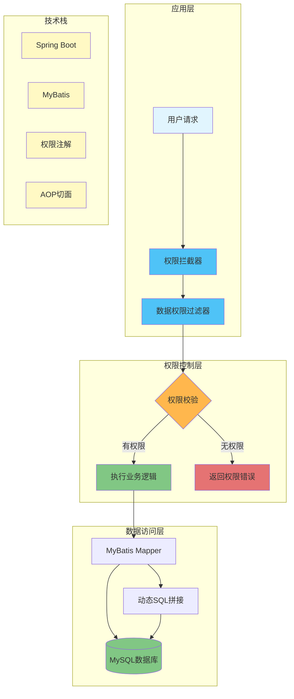
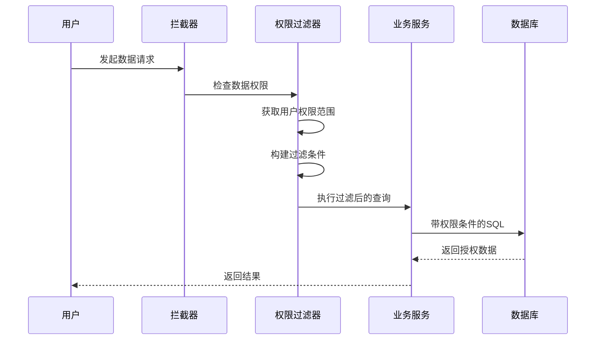

# st-dataAuthorityControl

数据权限控制测试项目，基于Spring Boot实现数据权限管理。

## 项目架构

```mermaid
graph TB
    subgraph 应用层
        A[用户请求] --> B[权限拦截器]
        B --> C[数据权限过滤器]
    end

    subgraph 权限控制层
        C --> D{权限校验}
        D -->|有权限| E[执行业务逻辑]
        D -->|无权限| F[返回权限错误]
    end

    subgraph 数据访问层
        E --> G[MyBatis Mapper]
        G --> H[(MySQL数据库)]
        G --> I[动态SQL拼接]
        I --> H
    end

    subgraph 技术栈
        J[Spring Boot]
        K[MyBatis]
        L[权限注解]
        M[AOP切面]
    end

    style A fill:#e1f5fe
    style B fill:#4fc3f7
    style C fill:#4fc3f7
    style D fill:#ffb74d
    style E fill:#81c784
    style F fill:#e57373
    style H fill:#81c784
    style J fill:#fff9c4
    style K fill:#fff9c4
    style L fill:#fff9c4
    style M fill:#fff9c4
```

## 权限过滤流程

```mermaid
sequenceDiagram
    participant U as 用户
    participant I as 拦截器
    participant F as 权限过滤器
    participant S as 业务服务
    participant D as 数据库

    U->>I: 发起数据请求
    I->>F: 检查数据权限
    F->>F: 获取用户权限范围
    F->>F: 构建过滤条件
    F->>S: 执行过滤后的查询
    S->>D: 带权限条件的SQL
    D-->>S: 返回授权数据
    S-->>U: 返回结果
```