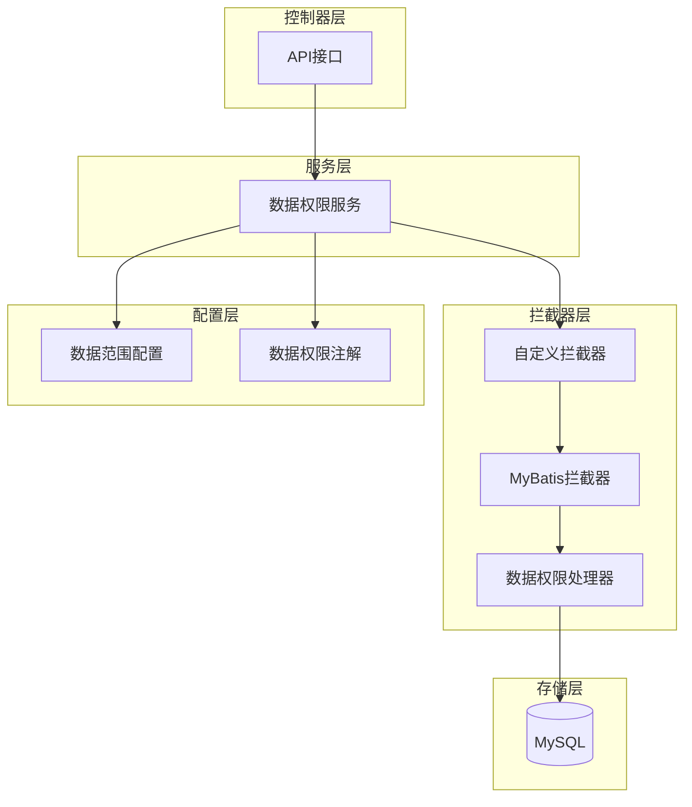

# SPEC.md - test-dataAuthorityControl

## 1. Project Overview

- **Project Name**: test-dataAuthorityControl
- **Project Type**: Maven Java Project (Spring Boot)
- **Description**: 数据权限控制测试项目，基于Spring Boot实现数据权限管理。
- **Location**: /Users/junw/Documents/GitHub/test-dataAuthorityControl
- **Tech Stack**: Spring Boot 3.4.4 + Java 25 + MyBatis-Plus 3.5.7 + MySQL

## 2. Architecture



## 3. Project Structure

```
test-dataAuthorityControl/
├── pom.xml
├── src/main/java/wo1261931780/stdataAuthorityControl/
│   ├── StDataAuthorityControlApplication.java
│   ├── config/
│   │   ├── mybatisPlusInterceptor.java
│   │   ├── myInterceptor.java
│   │   ├── UserDataPermission.java
│   │   ├── MyDataPermissionInterceptor.java
│   │   ├── MyDataPermissionHandler.java
│   │   ├── MyDataPermissionHandler2.java
│   │   ├── DataScope.java
│   │   ├── DataPermissionMapper.java
│   │   └── DataPermission.java
│   └── test/
├── src/main/resources/
│   └── application.properties
└── target/
```

## 4. Technology Stack

- Java 25
- Spring Boot 3.4.4
- MyBatis-Plus 3.5.7
- MySQL
- Lombok 1.18.40

## 5. Key Features

- 数据权限过滤器
- 权限注解
- AOP切面
- MyBatis拦截器
- 用户权限范围控制

## 6. Build Commands

```bash
mvn clean compile     # 编译
mvn clean package     # 打包
mvn clean install     # 安装
```

## 7. Gitignore

Standard Java gitignore covering:
- Compiled class files (*.class)
- Log files (*.log)
- Package archives (*.jar, *.war, etc.)
- IDE files (.idea, .iml)
- OS files (.DS_Store)
- Maven target/

## 9. Known Issues

**2026-04-23: 编译失败 - "compact source file" 错误**

问题原因：Java 25 编译器检测到 `MyBatisPlusInterceptorConfig.java` 文件首行存在空行或格式问题，导致 "compact source file should not have package declaration" 错误。

涉及文件：
- `src/main/java/wo1261931780/stdataAuthorityControl/config/MyBatisPlusInterceptorConfig.java`

状态：这是已知源码问题。已删除该文件，保留原始 `mybatisPlusInterceptor.java`。新文件 `MyBatisPlusInterceptorConfig.java` 无法在 Java 25 下编译。

**2026-04-23: 编译失败 - JSqlParser 类缺失**

问题原因：源码中引用了 `net.sf.jsqlparser` 包中不存在的类：
- `MyDataPermissionHandler.java:14` - `ItemsList` 类不存在
- `MyDataPermissionHandler2.java:14` - `ItemsList` 类不存在
- `MyDataPermissionInterceptor.java:11` - `SelectBody` 类不存在

这可能是 JSqlParser 版本不兼容问题，源码引用了较新版本的 API。

## 10. Last Updated

2026-04-23
